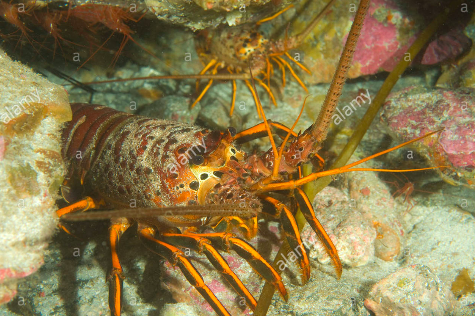

```{r setup, include=FALSE}
knitr::opts_chunk$set(echo = FALSE, warning = FALSE, eval = FALSE)
```

```{r, echo = FALSE, include = FALSE, eval = FALSE}
install.packages("directlabels")
install.packages("viridis")
install.packages("lmtest", repos = "http://cran.us.r-project.org")
install.packages("effsize")
install.packages("kableExtra")
```


```{r}
library(tidyverse)
library(janitor)
library(tidyr)
library(ggridges)
library(directlabels)
library(lattice)
library(viridis)
library(effsize)
library(kableExtra)
```

###INTRODUCTION



**Figure 1**: *Spiny Lobster* ([Credit: Alamy] (https://www.alamy.com/stock-photo/california-spiny-lobster.html))


###DATA AND METHODS


###RESULTS


```{r}
lobster_abundance <- read_csv("lobster_abundance_sbc_lter.csv",
                              na = "-99999") %>% 
  clean_names() 
```

```{r}
lobster_tidy <- lobster_abundance %>% 
  tidyr::uncount(count)
```


```{r}
lobster_ysite <- lobster_tidy %>% 
  select(year, site, size_mm) %>% 
  count(year, site) %>%  
  group_by(site, year) %>% 
  mutate(MPA = case_when(
    site %in% c("IVEE", "NAPL") ~ "MPA",
    site %in% c("AQUE", "MOHK", "CARP") ~ "non-MPA"))

```

```{r}
colnames(lobster_ysite)[colnames(lobster_ysite) =="n"] <- "total_count"

lobster_ysite$site[lobster_ysite$site == "AQUE"] <- "Arroyo Quemado"

lobster_ysite$site[lobster_ysite$site == "CARP"] <- "Carpinteria"

lobster_ysite$site[lobster_ysite$site == "IVEE"] <- "Isla Vista"

lobster_ysite$site[lobster_ysite$site == "MOHK"] <- "Mohawk"

lobster_ysite$site[lobster_ysite$site == "NAPL"] <- "Naples"
```

#Results A: Visually explore changes in annual lobster abundance (counts) by site
```{r}
ggplot(lobster_ysite, aes(x = year, y = total_count),
       show.legend = FALSE) +
  geom_line(aes(color = MPA),
            show.legend = FALSE) +
  facet_wrap(~site) +
  geom_point(aes(color = MPA, shape = MPA)) +
  scale_x_continuous(lim = c(2012, 2021), expand = c(0,0)) +
  scale_y_continuous(lim = c(0, 1000), expand = c(0,0)) +
  theme_minimal() +
  labs(title = "Annual Lobster Abundance by Site, 2012 - 2018",
       subtitle = "MPAs: IVEE & NAPL",
       x = "Year",
       y = "Total Lobster Observations",
       caption = "Figure 1: Lobster Abundance at 5 sites for year 2012 - 2018")  +
  geom_dl(aes(label = site, color = MPA), method = list("last.points", cex = .65, hjust = -.10))
            
```
 
```{r}
ggplot(lobster_ysite, aes(x = year, y = total_count),
       show.legend = FALSE) +
  geom_line(aes(color = site),
            show.legend = FALSE) +
  geom_point(aes(color = site, shape = site),
             show.legend = FALSE) +
  scale_x_continuous(lim = c(2012, 2019.5), expand = c(0,0)) +
  scale_y_continuous(lim = c(0, 1000), expand = c(0,0)) +
  theme_bw() +
  labs(title = "Annual Lobster Abundance by Site, 2012 - 2018",
       subtitle = "MPAs: IVEE & NAPL",
       x = "Year",
       y = "Total Lobster Observations",
       caption = "Figure 1: Lobster Abundance at 5 sites for year 2012 - 2018")  +
  geom_dl(aes(label = site, color = site), method = list("last.points", cex = .65, hjust = -.2))
```
 
 


```{r}
ggplot(lobster_ysite, aes(x = year, y = total_count, fill = site),
       show.legend = FALSE) +
  geom_col(aes(fill = MPA),
            alpha = 0.9) +
  facet_wrap(~site) +
  theme_dark() +
  scale_y_continuous(expand = c(0,0), lim = c(0,1000)) +
  scale_x_continuous(expand = c(0,0)) +
  labs(title = "Annual Lobster Abundance by Site, 2012 - 2018",
       subtitle = "MPAs: Isla Vista and Naples",
       x = "Year",
       y = "Total Lobster Observations",
       caption = "Figure 1: Lobster Abundance at 5 sites for year 2012 - 2018",
       fill = "Site")
```


Results B. Visually explore lobster size distribution shifts by comparing lobster sizes in 2012 and 2018.

```{r}
lobster_size <- lobster_tidy %>% 
  select(year, site, size_mm) %>% 
  filter(year %in% c(2012, 2018)) %>% 
  mutate(year = as.character(year))
  

lobster_size$site[lobster_size$site == "AQUE"] <- "Arroyo Quemado"

lobster_size$site[lobster_size$site == "CARP"] <- "Carpinteria"

lobster_size$site[lobster_size$site == "IVEE"] <- "Isla Vista"

lobster_size$site[lobster_size$site == "MOHK"] <- "Mohawk"

lobster_size$site[lobster_size$site == "NAPL"] <- "Naples"
```

Histogram for Results B
```{r}
ggplot(data = lobster_size) +
  geom_histogram(aes(x = size_mm, fill = site, alpha = 0.7, color = site),
                 binwidth = 6,
                 show.legend = FALSE) +
  facet_grid(year~site, scales = "free") +
  theme_minimal() +
  scale_y_continuous(expand = c(0,0)) +
  scale_x_continuous(expand = c(0,0)) +
  labs(title = "Lobster Size Distributions across 5 Sites",
       caption = "Figure 2: Lobster Size for 2012 & 2018",
       subtitle = "2012 & 2018",
       x = "Lobster Size (mm)",
       y = "Total Lobster Observations")
```
```{r}
ggplot(data = lobster_size) +
  geom_density(aes(fill = year, x = size_mm),
               alpha = 0.5) +
  facet_wrap(~site) +
  theme_bw() +
  labs(x = "Size (mm)", y = "Density", title = "Lobster Distribution Across 5 Sites", fill = "Year")
```


Results C. Compare mean lobster sizes at MPA vs. non-MPA sites in 2012 and 2018. 

```{r}
lobster_mean_size <- lobster_tidy %>% 
  mutate(mpa = case_when(
    site %in% c("IVEE", "NAPL") ~ "MPA",
    site %in% c("AQUE", "MOHK", "CARP") ~ "non-MPA")) %>% 
  filter(year %in% c(2012, 2018)) %>% 
  select(year, site, size_mm, mpa) %>% 
  group_by(year, mpa)
```


```{r}
lobster_size_table <- lobster_mean_size %>% 
  summarize(mean = mean(size_mm, na.rm = TRUE),
            sd = sd(size_mm, na.rm = TRUE),
            sample_size = n()) %>% 
  mutate_if(is.numeric, round, 1)
```


```{r}
lobster_size_table %>% 
  kable(col.names = c("Year",
                      "MPA",
                      "Mean",
                      "Standard Deviation",
                      "Sample Size")) %>% 
          kable_styling(bootstrap_options = "striped",
                        full_width = F,
                        position = "center") %>%
          add_header_above(c("Lobster Size Metrics" = 5)) %>% 
          row_spec(c(1:4),
                   color = "black")
```

```{r}
nonmpa_2012 <- lobster_mean_size %>% 
  filter(year =="2012", mpa == "non-MPA") 
nonmpa_2018 <- lobster_mean_size %>% 
  filter(year == "2018", mpa == "non-MPA")
mpa_2012 <- lobster_mean_size %>% 
  filter(year == "2012", mpa == "MPA") 
mpa_2018 <- lobster_mean_size %>% 
   filter(year == "2018", mpa == "MPA")

```

```{r}
size_2012_ttest <- t.test(mpa_2012$size_mm, nonmpa_2012$size_mm, paired = FALSE)
# If P value is lower than alpha (0.5), which it is, we reject the null hypothesis and confirm the alternative hypothesis as it indicates strong evidence against the null hypothesis.
size_2012_d <- effsize::cohen.d(mpa_2012$size_mm, nonmpa_2012$size_mm, na.rm = TRUE)
# Effect size is 0.61, which is a medium effect size, thus the difference can be noticed with some effort.

size_2018_ttest <- t.test(mpa_2018$size_mm, nonmpa_2018$size_mm, paired = FALSE)
# If P value is lower than alpha (0.5), which it is, we reject the null hypothesis and confirm the alternative hypothesis as it indicates strong evidence against the null hypothesis.
size_2018_d <- effsize::cohen.d(mpa_2018$size_mm, nonmpa_2018$size_mm, na.rm = TRUE)
# Effect size is 0.35, which is a small effect size, thus to notice the difference it would have to be studied.

size_mpa_ttest <- t.test(mpa_2012$size_mm, mpa_2018$size_mm, paired = FALSE)
# If P value is lower than alpha (0.5), which it is, we reject the null hypothesis and confirm the alternative hypothesis as it indicates strong evidence against the null hypothesis.
size_mpa_d <- effsize::cohen.d(mpa_2012$size_mm, mpa_2018$size_mm, na.rm = TRUE)
# Effect size is 0.87, which is a large effect size, thus the difference is easily noticeable. Cohen's D shows that the P value's rejection of the null hypothesis is easily noticeable.

size_nonmpa_ttest <- t.test(nonmpa_2012$size_mm, nonmpa_2018$size_mm, paired = FALSE)
# If P value is lower than alpha (0.5), which it is NOT, thus we fail to reject the null hypothesis as it indicates weak evidence against the null hypothesis.
size_nonmpa_d <- effsize::cohen.d(nonmpa_2012$size_mm, nonmpa_2018$size_mm, na.rm = TRUE)
# Effect size is 0.12, which is a small effect size, thus the difference between the samples is not easily noticeable. Cohen's D confirms that the uncertainty in the rejection of the null hypothesis, as indicated by the P value, is small.
```

*Null Hypothesis*: The mean size, in millimeters, of lobsters collected at MPA sites vs non-MPA sites are the same.

*Alternate Hypothesis*: The mean size, in millimeters, of lobsters collected at MPA sites vs non-MPA sites are not the same.


SUMMARY

-testing

REFERENCES