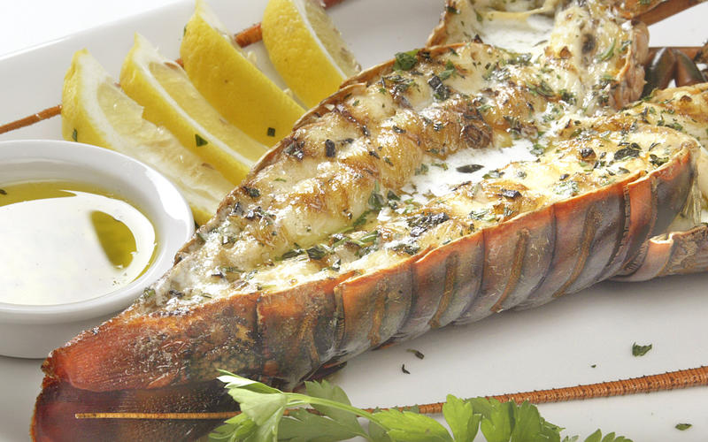

```{r setup, include=FALSE}
knitr::opts_chunk$set(warning = FALSE)
```

```{r, echo = FALSE, include = FALSE, eval=FALSE}
install.packages("directlabels")
install.packages("viridis")
install.packages("lmtest", repos = "http://cran.us.r-project.org")
install.packages("effsize")
install.packages("kableExtra")
```


```{r, echo = FALSE, include = FALSE}
library(tidyverse)
library(janitor)
library(tidyr)
library(ggridges)
library(directlabels)
library(lattice)
library(viridis)
library(effsize)
library(kableExtra)
```
<br>

### INTRODUCTION

The California Spiny Lobster, *Panulirus interruptus*, is a decapod crustacean that has a habitat that spans from the Monterey Bay, California to Baja California, Mexico (Sea Grant California 2019). The California Spiny Lobster is one of the largest spiny lobsters in the world with males capable of growing up to three feet long and weighing up to 26 pounds. Fishing of California Spiny Lobster is regulated by the California Department of Fish and Wildlife and has an open season from October through March (California Department of Fish and Wildlife and Sea Grant California 2019).

Data on California Spiny Lobsters has been collected off of the coast of Santa Barbara by the Santa Barbara Coastal Term Ecological Research (SBC LTER), an interdisciplinary program based at the University of California, Santa Barbara Marine Science Institute. SB LTER has been collecting data on size, abundance, and fishing pressure of California Spiny Lobster at five study sites along the Santa Barbara Channel since 2012. Two of the sites, Naples and Isla Vista, are within Marine Protected Areas (MPAs) and three of the sites, Arroyo Quemado, Mohawk, and Carpinteria, are otuside of MPAs (Reed D. 2019). In an effort to investigate lobster size differences or similarities between the study sites within an MPA and those outside of an MPA, this report will analyze lobster sizes between the years of 2012 and 2018 and across the five different study sites.


***Figure 1: California Spiny Lobster Underwater.*** *California Spiny Lobster walking on the sea floor. (Credit: [Vice](https://www.vice.com/en_us/article/gvk5kq/why-we-dont-eat-california-spiny-lobsters-even-though-they-taste-better))*



***Figure 2: Cooked California Lobster.*** *A cooked California Spiny Lobster on a dish with butter and lemons. (Credit: [Sea Grant California](https://caseagrant.ucsd.edu/seafood-profiles/spiny-lobster))*


**Figure 3. Study Sites.** *The five California Spiny Lobster study sites where data is collected by SBC LTER.  (Credit: [Reed D. 2019.](
https://doi.org/10.6073/pasta/a593a675d644fdefb736750b291579a0))*


<br>

### DATA AND METHODS

<br>

### RESULTS

```{r, include = FALSE, echo=FALSE}
lobster_abundance <- read_csv("lobster_abundance_sbc_lter.csv",
                              na = "-99999") %>% 
  clean_names() 
```

```{r, include=FALSE, echo=FALSE}
lobster_tidy <- lobster_abundance %>% 
  tidyr::uncount(count)
```


```{r, include = FALSE, echo = FALSE}
lobster_ysite <- lobster_tidy %>% 
  select(year, site, size_mm) %>% 
  count(year, site) %>%  
  group_by(site, year) %>% 
  mutate(MPA = case_when(
    site %in% c("IVEE", "NAPL") ~ "MPA",
    site %in% c("AQUE", "MOHK", "CARP") ~ "non-MPA"))

```

```{r, include = FALSE, echo = FALSE}
colnames(lobster_ysite)[colnames(lobster_ysite) =="n"] <- "total_count"

lobster_ysite$site[lobster_ysite$site == "AQUE"] <- "Arroyo Quemado"

lobster_ysite$site[lobster_ysite$site == "CARP"] <- "Carpinteria"

lobster_ysite$site[lobster_ysite$site == "IVEE"] <- "Isla Vista"

lobster_ysite$site[lobster_ysite$site == "MOHK"] <- "Mohawk"

lobster_ysite$site[lobster_ysite$site == "NAPL"] <- "Naples"
```


#### Results A: Visually explore changes in annual lobster abundance (counts) by site

```{r, echo = FALSE}
ggplot(lobster_ysite, aes(x = year, y = total_count, fill = site),
       show.legend = FALSE) +
  geom_col(aes(fill = MPA),
            alpha = 0.9) +
  facet_wrap(~site) +
  theme_dark() +
  scale_y_continuous(expand = c(0,0), lim = c(0,1000)) +
  scale_x_continuous(expand = c(0,0)) +
  labs(x = "Year",
       y = "Total Lobster Observations",
       fill = "Site")
```
***Figure 4: Annual Lobster Abundance.*** 
*Lobster counts at the Arroyo Quemado, Carpinteria, Isla Vista, Mohawk, and Naples study sites between the years of 2012 - 2018. Data: [Reed D. 2019.](
https://doi.org/10.6073/pasta/a593a675d644fdefb736750b291579a0)*


#### Results B. Visually explore lobster size distribution shifts by comparing lobster sizes in 2012 and 2018.

```{r, echo = FALSE}
lobster_size <- lobster_tidy %>% 
  select(year, site, size_mm) %>% 
  filter(year %in% c(2012, 2018)) %>% 
  mutate(year = as.character(year))
  

lobster_size$site[lobster_size$site == "AQUE"] <- "Arroyo Quemado"

lobster_size$site[lobster_size$site == "CARP"] <- "Carpinteria"

lobster_size$site[lobster_size$site == "IVEE"] <- "Isla Vista"

lobster_size$site[lobster_size$site == "MOHK"] <- "Mohawk"

lobster_size$site[lobster_size$site == "NAPL"] <- "Naples"
```

```{r, echo = FALSE}
ggplot(data = lobster_size) +
  geom_histogram(aes(x = size_mm, fill = site, alpha = 0.7, color = site),
                 binwidth = 6,
                 show.legend = FALSE) +
  facet_grid(year~site, scales = "free") +
  theme_minimal() +
  scale_y_continuous(expand = c(0,0)) +
  scale_x_continuous(expand = c(0,0)) +
  labs(x = "Lobster Size (mm)",
       y = "Total Lobster Observations")
```
***Figure 5: Lobster Size Distributions Across 5 Study Sites***
*Lobster size distribution of observations across the Arroyo Quemado, Carpinteria, Isla Vista, Mohawk, and Naples study sites for the years 2012 and 2018. Data: [Reed D. 2019.](
https://doi.org/10.6073/pasta/a593a675d644fdefb736750b291579a0)*


#### Results C. Compare mean lobster sizes at MPA vs. non-MPA sites in 2012 and 2018. 

```{r, echo = FALSE}
lobster_mean_size <- lobster_tidy %>% 
  mutate(mpa = case_when(
    site %in% c("IVEE", "NAPL") ~ "MPA",
    site %in% c("AQUE", "MOHK", "CARP") ~ "non-MPA")) %>% 
  filter(year %in% c(2012, 2018)) %>% 
  select(year, site, size_mm, mpa) %>% 
  group_by(year, mpa)
```


```{r, echo = FALSE, message= FALSE}
lobster_size_table <- lobster_mean_size %>% 
  summarize(mean = mean(size_mm, na.rm = TRUE),
            sd = sd(size_mm, na.rm = TRUE),
            sample_size = n()) %>% 
  mutate_if(is.numeric, round, 1)
```

***Table 1: Lobster Size Metrics***
*Means, Standard Deviations, and Sample Sizes of the California Spiny Lobsters for the years 2012 and 2018 between the MPA and non-MPA Sites. Data: [Reed D. 2019.](
https://doi.org/10.6073/pasta/a593a675d644fdefb736750b291579a0)*
```{r, echo = FALSE}
lobster_size_table %>% 
  kable(col.names = c("Year",
                      "MPA",
                      "Mean",
                      "Standard Deviation",
                      "Sample Size")) %>% 
          kable_styling(bootstrap_options = "striped",
                        full_width = F,
                        position = "center") %>% 
          row_spec(c(1,3),
                   color = "red") %>% 
  row_spec(c(2,4),
                   color = "black")
```

```{r, echo = FALSE}
nonmpa_2012 <- lobster_mean_size %>% 
  filter(year =="2012", mpa == "non-MPA") 
nonmpa_2018 <- lobster_mean_size %>% 
  filter(year == "2018", mpa == "non-MPA")
mpa_2012 <- lobster_mean_size %>% 
  filter(year == "2012", mpa == "MPA") 
mpa_2018 <- lobster_mean_size %>% 
   filter(year == "2018", mpa == "MPA")

```

```{r, echo = FALSE}
size_2012_ttest <- t.test(mpa_2012$size_mm, nonmpa_2012$size_mm, paired = FALSE)
# If P value is lower than alpha (0.5), which it is, we reject the null hypothesis and confirm the alternative hypothesis as it indicates strong evidence against the null hypothesis.
size_2012_d <- effsize::cohen.d(mpa_2012$size_mm, nonmpa_2012$size_mm, na.rm = TRUE)
# Effect size is 0.61, which is a medium effect size, thus the difference can be noticed with some effort.

size_2018_ttest <- t.test(mpa_2018$size_mm, nonmpa_2018$size_mm, paired = FALSE)
# If P value is lower than alpha (0.5), which it is, we reject the null hypothesis and confirm the alternative hypothesis as it indicates strong evidence against the null hypothesis.
size_2018_d <- effsize::cohen.d(mpa_2018$size_mm, nonmpa_2018$size_mm, na.rm = TRUE)
# Effect size is 0.35, which is a small effect size, thus to notice the difference it would have to be studied.

size_mpa_ttest <- t.test(mpa_2012$size_mm, mpa_2018$size_mm, paired = FALSE)
# If P value is lower than alpha (0.5), which it is, we reject the null hypothesis and confirm the alternative hypothesis as it indicates strong evidence against the null hypothesis.
size_mpa_d <- effsize::cohen.d(mpa_2012$size_mm, mpa_2018$size_mm, na.rm = TRUE)
# Effect size is 0.87, which is a large effect size, thus the difference is easily noticeable. Cohen's D shows that the P value's rejection of the null hypothesis is easily noticeable.

size_nonmpa_ttest <- t.test(nonmpa_2012$size_mm, nonmpa_2018$size_mm, paired = FALSE)
# If P value is lower than alpha (0.5), which it is NOT, thus we fail to reject the null hypothesis as it indicates weak evidence against the null hypothesis.
size_nonmpa_d <- effsize::cohen.d(nonmpa_2012$size_mm, nonmpa_2018$size_mm, na.rm = TRUE)
# Effect size is 0.12, which is a small effect size, thus the difference between the samples is not easily noticeable. Cohen's D confirms that the uncertainty in the rejection of the null hypothesis, as indicated by the P value, is small.
```

*Null Hypothesis*: The mean size, in millimeters, of lobsters collected at MPA sites vs non-MPA sites are the same.

*Alternate Hypothesis*: The mean size, in millimeters, of lobsters collected at MPA sites vs non-MPA sites are not the same...

<br>

### SUMMARY


<br>

### REFERENCES

**California Department of Fish & Wildlife and Sea Grant Foundation.** California Spiny Lobster: fishing and life history information. https://nrm.dfg.ca.gov/FileHandler.ashx?DocumentID=36321&inline. Accessed 11/17/2019.

**Clarissa Wei.** 2016. Vice. Why We Don't Eat California Spiny Lobsters (Even Though They Taste Better). https://www.vice.com/en_us/article/gvk5kq/why-we-dont-eat-california-spiny-lobsters-even-though-they-taste-better. Photo by Kate Mansury. Accessed 11/17/2019.

**Reed D. 2019.** SBC LTER: Reef: Abundance, size and fishing effort for California Spiny Lobster (Panulirus interruptus), ongoing since 2012. Environmental Data Initiative. https://doi.org/10.6073/pasta/a593a675d644fdefb736750b291579a0. Dataset accessed 10/30/2019.

**Sea Grant California.** California Seafood Profiles, About, Spiny Lobster: Panulirus interruptus. https://caseagrant.ucsd.edu/seafood-profiles/spiny-lobster. Accessed 11/17/2019.

